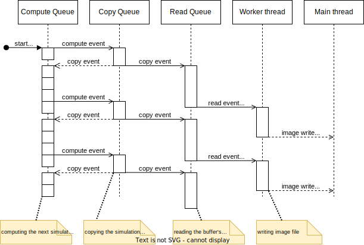

# Callback sample - synchronizing Command Queues with Events

## Sample purpose

This sample demonstrates how to synchronize the execution of multiple command queues with each other and with host-side calculations.

## Key APIs and Concepts

If all operations are enqueued on a single command queue, the execution of the operations is sequential, and the ordering of the operations matches the order in which they were enqueued (unless `CL_QUEUE_OUT_OF_ORDER_EXEC_MODE_ENABLE` was specified).

However, sometimes it is more performant to enqueue unrelated operations to separate command queues, enabling the parallel execution capabilities of the device. The primer utility of synchronization across command queues are **OpenCL event objects**. Each enqueue operation can take a list of events which it will synchronize with. Also, each enqueue operation can emit a single event object that can be used to synchronize other operations with that one. Additionally, using the **callback functionality**, host code can be executed at various points in the event's lifetime.

### Kernel logic

The sample implements the simulation of a theoretical chemical reaction, namely the [Gray-Scott model](https://groups.csail.mit.edu/mac/projects/amorphous/GrayScott/) of the [reaction-diffusion system](https://en.wikipedia.org/wiki/Reaction%E2%80%93diffusion_system). Explaining the algorithm is not the goal of this example. We only need to know, that the simulation progresses iteratively: given a 2D lattice of the concentration of the $U$ and $V$ chemicals (stored in the R and G channels of an image texture respectively), the subsequent state is calculated by the kernel. The algorithm results in visually interesting shapes, with the order being obvious to the viewer: the more "spread" chemical $V$ is, the later iteration step we observe.

## Application flow

### Overview

From an initial state, the iteration progresses through a fixed number of steps. The number of steps can be specified on the command line. Two 2D image objects are used to store the state of the simulation, one for the input and another for the output state, and the images are swapped after each step. At every Nth iteration (N being controlled from the command line), the state of the simulation is dispatched for writing to the disk as a PNG image.

### Command queues and synchronization

<p align="center">
    
</p>

In this example, kernel launches, image-to-buffer copies (device-to-device copy) and buffer reads (device-to-host copy) are performed. Some systems allow the overlapping of these operations, thereby it makes sense to enqueue all three of these operation types to separate command queues. The journey of each iteration state is the following:

1. The state is calculated from the previous state by the `reaction_diffusion_step` kernel. The kernel launch synchronizes with the previous image-to-buffer copy, which could have happened in the previous iteration, but also quite a few iterations ago.
2. If the iteration index is a multiple of N, a device buffer object and a host vector of the same size are allocated. Otherwise, the next iteration starts calculating at step 1.
3.  A copy of the output image to the allocated buffer object is enqueued. Eventually the simulation state is read to host memory, but since device-to-device copy is usually faster than device-to-host copy, first the previous output image is copied to a buffer and this buffer is read to the host in step 4. Note, that the copy can be performed concurrently with the kernel launch of the next iteration, since they both read from the same image object. Only the subsequent iteration's compute launch has to synchronize with this copy.
4. The read of the buffer (i.e. device-to-host copy) is enqueued on the read queue. If the device has concurrent copy capabilities, this read potentially overlaps with a previous copy (step 3.) operation.
5. After the read of the buffer is completed, its contents need to be written to an image file. This has to synchronize with the read operation, but this time, we need to execute host code instead of an OpenCL enqueue. For that, we set the completion callback of the event produced by the read enqueue. A `void*` argument is passed to the callback, which is used to identify the host vector containing the data. 
6. The callback is executed on a thread used by the OpenCL runtime. Therefore it is advised that the callback returns as quickly as possible. To achieve this, the image write is dispatched to a different thread, using `std::async` in the C++ version of the sample, and `thrd_create` in the C version.
7. When the image write has finished, the completion is signaled back to the waiting main thread, otherwise the executable would possibly exit before completion. For this purpose `std::future::wait` is used in the C++ version, and a conditional variable in the C version.

## Used API surface (C++)

```c++
cl::Buffer::Buffer(cl::Context, cl_mem_flags, std::size_t size)
cl::CommandQueue::enqueueCopyImageToBuffer(cl::Image2D, cl::Buffer, std::array<size_type, 3>,
                                           std::array<size_type, 3>, std::size_t,
                                           std::vector<cl::Event>*, cl::Event*)
cl::CommandQueue::enqueueFillImage(cl::Image2D, cl_float4, std::array<size_type, 3>, std::array<size_type, 3>)
cl::CommandQueue::enqueueReadBuffer(cl::Buffer, bool, std::size_t, std::size_t,
                                    void*, std::vector<cl::Event>*, cl::Event*)
cl::Context::getInfo<CL_CONTEXT_DEVICES>()
cl::Context::getSupportedImageFormats(cl_mem_flags, cl_mem_object_type, std::vector<cl::ImageFormat>*)
cl::Device::getInfo<CL_DEVICE_NAME>()
cl::Device::getInfo<CL_DEVICE_PLATFORM>()
cl::EnqueueArgs::EnqueueArgs(cl::CommandQueue, cl::Event, cl::NDRange)
cl::Event::Event()
cl::Event::Event(cl::Event)
cl::Event::setCallback(cl_int, void(*)(cl_event, cl_int, void*), void*)
cl::Image2D::Image2D(cl::Context, cl_mem_flags, cl::ImageFormat, std::size_t, std::size_t)
cl::ImageFormat::ImageFormat(cl_channel_order, cl_channel_type)
cl::KernelFunctor<cl::Image2D, cl::Image2D>(cl::Program, std::string)
cl::NDRange(std::size_t, std::size_t)
cl::Platform::getInfo<CL_PLATFORM_VENDOR>()
cl::Platform::Platform(cl_platform)
cl::Program::build(cl::Device)
cl::Program::Program(cl::Context, std::string)
cl::sdk::comprehend()
cl::sdk::parse()
cl::sdk::parse_cli()
cl::UserEvent::setStatus(cl_int)
cl::UserEvent::UserEvent(cl::Context)
```

## Used API surface (C)

```c
clCreateBuffer
clCreateCommandQueueWithProperties
clCreateContext
clCreateImage
clCreateKernel
clCreateProgramWithSource
clEnqueueCopyImageToBuffer
clEnqueueFillImage
clEnqueueNDRangeKernel
clEnqueueReadBuffer
clGetDeviceInfo
clGetSupportedImageFormats
clReleaseCommandQueue
clReleaseContext
clReleaseDevice
clReleaseEvent
clReleaseEvent
clReleaseKernel
clReleaseMemObject
clReleaseProgram
clSetEventCallback
clSetKernelArg
cnd_destroy
cnd_signal
mtx_destroy
mtx_lock
mtx_unlock
thrd_create
thrd_detach
```
